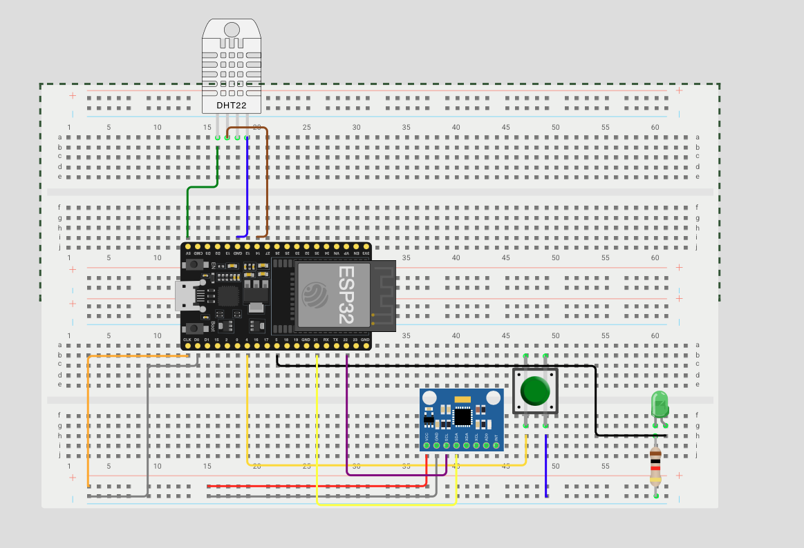
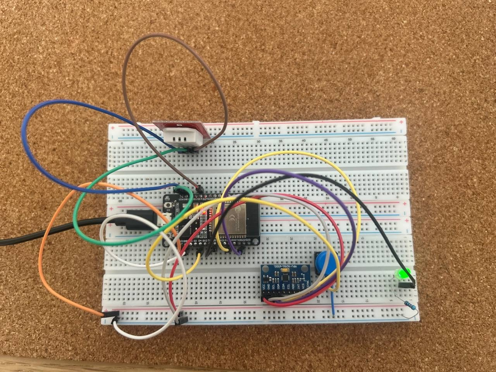
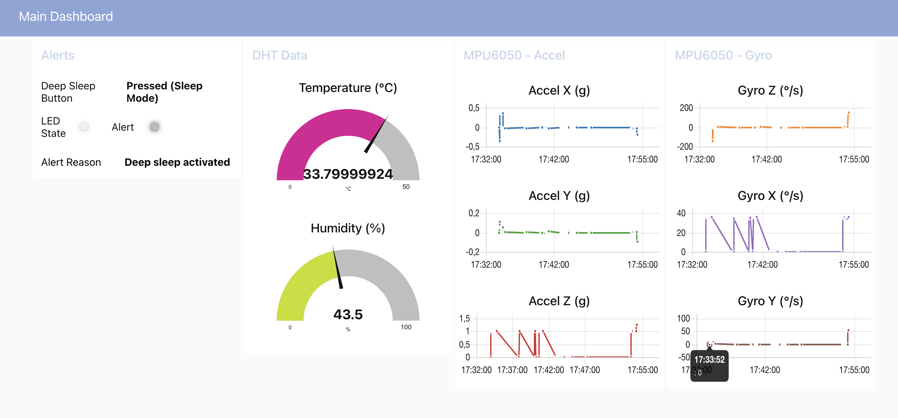
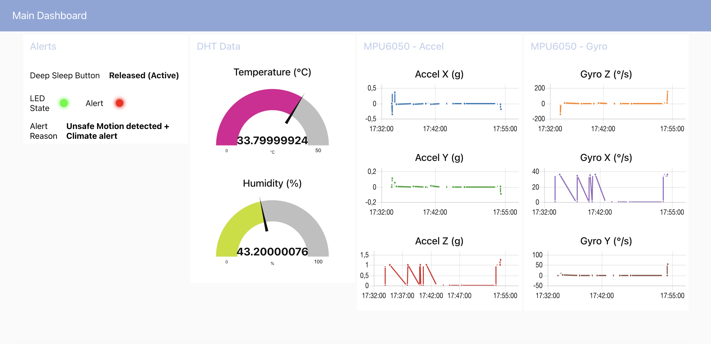

# ESP32-Raspberry Pi-MQTT Broker-Node-RED Motorcycle Motion Monitoring System

*A smart monitoring system with motion, climate sensing and web interface*

## 📋 Project Overview
This ESP32-based system monitors:
- Motion/orientation (MPU6050 accelerometer/gyroscope)
- Temperature and humidity (DHT22 (alternative - DHT11))
- Features low-power sleep mode
- Provides LED signals for power-on, deep sleep entry, and wake-up
- Provides visual sensors data feedback via LED
- Remote communication via:
  - Built-in web server
  - MQTT protocol through Raspberry Pi broker
- Node-RED Dashboard for real-time monitoring

## 🛠 Hardware Setup
| Component       | ESP32 Pin | Connection Notes          |
|-----------------|----------|--------------------------|
| MPU6050 (VCC)   | 3.3V     | Power supply             |
| MPU6050 (GND)   | GND      | Ground                   |
| MPU6050 (SDA)   | GPIO 21  | I2C data line            |
| MPU6050 (SCL)   | GPIO 22  | I2C clock line           |
| DHT22 (VCC)     | 5V       | Power supply             |
| DHT22 (DATA)    | GPIO 14  | Data pin with pull-up    |
| DHT22 (GND)     | GND      | Ground                   |
| LED (Anode)     | GPIO 5   | Through current-limiting resistor |
| Button          | GPIO 4   | Other side to GND        |

Model simulation using wokwi.com online service just for visualization:


Real board configuration:


## 📝 Code Functionality
<a href="src/main.cpp">Source code.</a>

### Key Features
- **Sensor Monitoring**:
  - Continuous MPU6050 motion/orientation tracking
  - Periodic DHT22 climate measurements
- **Smart LED Control**:
  - LED turns on when motion is detected (configurable threshold)
  - LED turns on when humidity > 80% OR temperature < 10°C or > 25°C
  - LED turns on when motion is dangerous (AcX or GyX > threshold)
  - LED briefly turns on at power-up (indicates ignition/power-on)
  - LED flashes during deep sleep entry and wake-up to indicate state transitions
- **Power Management**:
  - Deep sleep mode activated by button press
  - Wake-up from sleep via same button
- **Web Interface**:
  - Built-in HTTP server (port 80)
  - JSON API endpoint (`/data`)
  - Auto-refreshing web dashboard
- **MQTT Integration**:
Publishes sensor data to MQTT topic every N seconds.
Topics used:
  - esp32/motion
  - esp32/climate
  - esp32/status
- **ESP32 Deep Sleep**:
Project features deep sleep mode to save power, with MQTT messages sent before entering sleep. How it works:
- The device connects and maintains MQTT connection.
- Sensor data and button state are read periodically.
- If the button is pressed, ESP32 publishes a message and immediately enters deep sleep.
- If sensor readings indicate normal conditions, data is sent via MQTT, then the device enters deep sleep after publishing "deep sleep activated" messages.
- If abnormal conditions (e.g., extreme temperature, humidity, or movement) are detected, alerts are published, LED indicators light up, and the device stays awake.
- Wake-up from deep sleep is triggered by a button press, upon which the ESP32 sends an "AWAKE" MQTT message and resumes normal operation.

This cycle repeats indefinitely, optimizing power consumption while maintaining real-time monitoring and communication.

 
## 🧠 Raspberry Pi Setup

### 🔧 MQTT Broker (Mosquitto)

**Install:**

```
bash
sudo apt update
sudo apt install mosquitto mosquitto-clients
```

Configure /etc/mosquitto/mosquitto.conf:

```
с
listener 1883
allow_anonymous true
```

Restart Broker:
```
bash
sudo systemctl restart mosquitto
```

Check Port:
```
bash
sudo netstat -anp | grep 1883
```
Should return:
```
nginx
tcp 0 0 0.0.0.0:1883 0.0.0.0:* LISTEN ...
```
## 🧠 Node-RED Dashboard
Install Node-RED:
```
bash
bash <(curl -sL https://raw.githubusercontent.com/node-red/linux-installers/master/deb/update-nodejs-and-nodered)
```
Start Node-RED:
```
bash
node-red-start
```
Access Node-RED:
```
cpp
http://<RPI_IP>:1880
```
Configure MQTT Nodes:

Broker: tcp://localhost:1883

Subscribed Topics:

esp32/motion

esp32/climate

esp32/status

Dashboard elements:

Gauges for temperature/humidity

Charts for sensor values

Text/status indicators

#### Example of Node-Red flow
<a href="Node-RED.json" target="_blank">Source code.</a>


#### Example of Node-Red UI dashboard 
Deep sleep mode is activated:


Deep sleep mode is not activated:


### 🔄 Workflow
1. ESP32 initializes sensors and connects to WiFi & MQTT
2. On startup:
- LED briefly turns on to indicate ignition
3. In main loop:
- Reads sensor data
- Checks button state
- Controls LED based on motion and environmental conditions
- MQTT publishing
- Web interface handling
4. On button press:
- LED flashes, system enters deep sleep
5. On wake-up:
- LED flashes, system resumes normal operation
## Database
Data from the ESP32 microcontroller is collected and stored in a local SQLite database hosted on a Raspberry Pi.

## 🚀 Getting Started
### Prerequisites
- ESP32 development board
- Arduino IDE/PlatformIO
- Required libraries:
  - `Wire.h` (I2C)
  - `WiFi.h`
  - `DHT.h`
  - `Arduino.h`
  - `PubSubClient.h`
  - `ArduinoJson.h`

### Installation
1. Clone this repository
2. Open in Arduino IDE/PlatformIO
3. Update WiFi credentials in code:
```
cpp
const char *ssid = "YOUR_SSID";
const char *pass = "YOUR_PASSWORD";
```
4. Update MQTT settings

```
cpp
const char *mqtt_server = "YOUR_RPI_IP";
const int mqtt_port = 1883;

const char *topic_motion = "esp32/motion";
const char *topic_climate = "esp32/climate";
const char *topic_status = "esp32/status"; 
```

5. Upload to ESP32
6. Run Node-RED and Mosquitto
```
node-red-start
mosquitto_sub -t esp32/sensors -v
```
7. 🎉 View live data:
- In terminal via mosquitto_sub
- In Node-RED dashboard (http://192.168.0.127:1880/ui)
- At ESP32 IP /data
